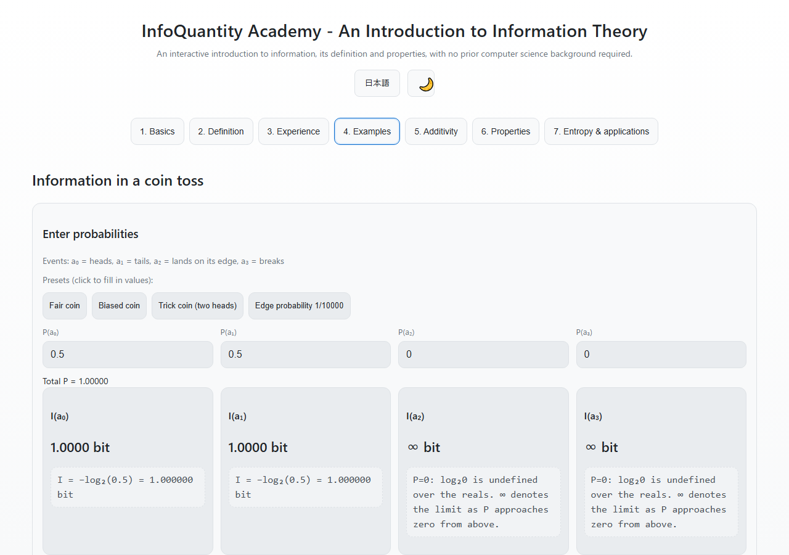
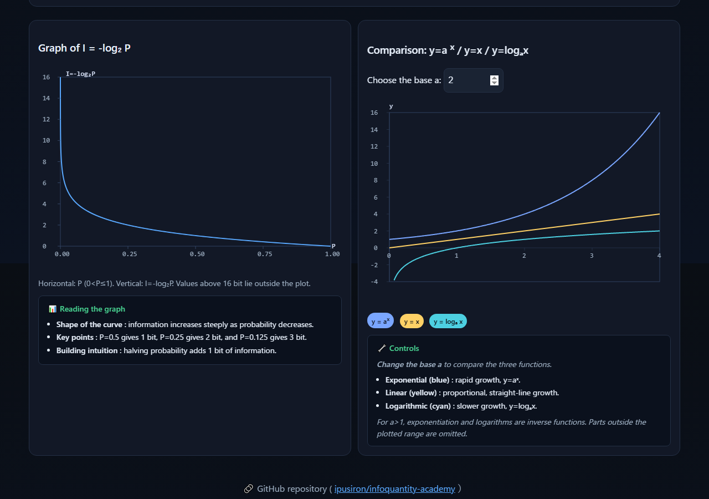

<!--
---
id: day073
slug: infoquantity-academy

title: "InfoQuantity Academy"

subtitle_ja: "情報量の基礎学習ツール"
subtitle_en: "Interactive Information Theory Learning Tool"

description_ja: "コンピューターサイエンスや数学に不慣れでも、情報量 I(a)=-log₂P(a) の直感と定義・性質を対話的に学べる入門ツール。対数クイズ、驚き度体感スライダー、計算例、加算性、エントロピーまで段階的に学習。"
description_en: "A beginner-friendly interactive web tool to grasp information quantity with definitions, worked examples, additivity, properties, and entropy. Learn Shannon's information theory through quizzes, intuition sliders, and interactive calculators."

category_ja:
  - 情報理論
category_en:
  - Information Theory

difficulty: 3

tags:
  - information-theory
  - information-quantity
  - shannon
  - entropy
  - education
  - visualization
  - javascript

repo_url: "https://github.com/ipusiron/infoquantity-academy"
demo_url: "https://ipusiron.github.io/infoquantity-academy/"

hub: true
---
-->

English · [日本語](README.md)

# InfoQuantity Academy - Interactive Information Theory Learning Tool


[](https://ipusiron.github.io/infoquantity-academy/)

**Day073 - 100 Security Tools Built with Generative AI**

InfoQuantity Academy is an introductory tool with seven tabs for calculating information from probabilities and learning about logarithms, additivity, and entropy. Information measures rarity within a specified probability model; it is distinct from the importance of content or a person's emotional surprise.

## 🌐 Live demo

[日本語で開く](https://ipusiron.github.io/infoquantity-academy/?lang=ja) · [Open in English](https://ipusiron.github.io/infoquantity-academy/?lang=en)

Use it in your browser, or download the folder and open index.html directly.

## 📸 Screenshots



In a model assigning 0.5 to both heads and tails, each outcome provides 1 bit.


Compare the information associated with a predicted probability of 25% and a model probability of 50%. Subjective surprise is not scored.



Explore the relationship between probability and information. Images are 1280×900px.

## 🎯 Purpose and features

- Learn I(a) = −log₂P(a) through logarithm quizzes and graphs
- Compare predicted and model probabilities and their information values
- Record subjective surprise from 1 to 10 (up to 100 records, without scoring)
- Explore additivity for independent events, monotonicity, continuity, and normalization
- Calculate average information H(X) for distributions of up to 4 events
- Calculate candidate counts and average guesses for uniformly random strings
- Switch between Japanese and English and light and dark themes

## 📖 How to use

Start by selecting “Fair coin” in the Examples tab. Check that P(a₀)=P(a₁)=0.5 and each has 1 bit of information. The remaining events have probability 0, so their information is displayed as ∞; this does not imply that those events actually occur.

### Suggested learning sequence

1. Answer the 3 logarithm questions in Basics.
2. Explore the relationship between probability and information in Definition.
3. Choose an event in Experience, enter your surprise and predicted probability, and compare them with the model.
4. Change values in Examples, Additivity, and Properties, and inspect the calculations.
5. Compare distribution bias and average information in Entropy & applications.

### Language, theme, and records

The initial language is selected from the URL's lang=ja/en parameter, saved preference, and browser language, in that order. The theme uses the saved preference, then the operating-system preference. The tool remains usable if storage is unavailable.

Switching languages preserves inputs, records, and quiz answers. Only theme and language are saved in localStorage; inputs and learning records are not saved. Reloading clears the records. “Clear records” clears the Experience records, while “Reset” clears quiz answers.

Use Tab to focus the tab bar, then the left/right arrows, Home, or End to switch tabs.

## 👥 Intended users

- Students learning probability, logarithms, and information theory
- Teachers demonstrating worked examples
- Developers examining assumptions behind compression, anomaly scores, and prediction models
- Learners distinguishing key uncertainty from cryptographic security strength

## 📋 Tabs

| Tab | Content |
|---|---|
| 1. Basics | A 3-question logarithm quiz and step-by-step explanations |
| 2. Definition | I(a)=−log₂P(a), with logarithmic, exponential, and linear comparisons |
| 3. Experience | Prediction/model comparisons and records of surprise and information |
| 4. Examples | 4 coin events, presets, and calculation steps |
| 5. Additivity | Independent events and identifying equally likely rooms |
| 6. Properties | Monotonicity, continuity, additivity, and normalization |
| 7. Entropy & applications | Average information, compression, cryptography, physics, and machine learning |

Events in Experience are individual teaching examples, not necessarily mutually exclusive and exhaustive outcomes within a scenario. Weather and lottery probabilities are not measurements, forecasts, or the odds of real products. For a fair die, rolling a 1 on all 6 rolls has probability 1/46656.

## 🧮 Information and entropy

### Definition and additivity

Information is I(a)=−log₂P(a). For independent A and B, P(A∧B)=P(A)P(B), so I(A∧B)=I(A)+I(B). Without independence, conditional probability is needed.

Assuming additivity and monotonicity for positive probabilities determines the logarithmic form. Normalizing information at P=1/2 to 1 gives the unit bit. Natural logarithms give nat, and base-10 logarithms give dit.

The reciprocal 1/P alone does not turn products of probabilities into sums of information. Taking a logarithm makes independent information additive.

### Zero probability and continuity

log₂0 is undefined over the reals. The tool displays ∞ for the limit as P approaches 0 from above. If an event assigned probability 0 is observed in a discrete model, the model's assumptions need to be reconsidered.

In entropy H(X)=−ΣP(x)log₂P(x), a probability-zero term contributes 0 by its limit. Differences between infinities are not computed, and recorded infinite values are not replaced by finite ones. Only finite values are plotted.

−log₂P is continuous for 0<P≤1, but equal probability differences produce larger information differences near 0. Comparing just two points does not determine continuity.

### Reference calculations

| Condition | Result |
|---|---|
| P=1 | 0 bit |
| P=0.5 | 1 bit |
| P=0.125 | 3 bit |
| P=0.0001 | Approximately 13.287712 bit |
| P=0 | ∞ bit (limit notation) |
| Distribution (0.25, 0.25, 0.25, 0.25) | H=2 bit |
| Distribution (1, 0, 0, 0) | H=0 bit |
| 16 floors × 8 rooms, all equally likely | 4+3=7 bit |
| 26 equally likely candidates, guessed without repetition | Average 13.5 guesses |

## ⚙️ Input and display rules

| Input | Range or condition |
|---|---|
| Probability | 0–1; empty, negative, out-of-range, and nonnumeric values are errors |
| Distribution | Total 1, tolerance 0.000001 |
| Predicted probability | 0–100% |
| Floors and rooms per floor | Integers from 1 to 1000 |
| String length and alphabet size | Integers from 1 to 100 and from 1 to 95 |
| Comparison graph base a | Greater than 1 and no greater than 100 |
| Monotonicity slider | 0.0001–1 |
| Experience records | Up to 100 |

Invalid inputs are not rounded, clamped into range, or automatically normalized. Invalid results display “—” and an error message. Displayed values are rounded, so sums of displayed numbers may differ slightly.

If the product of independent probabilities underflows the floating-point range, information is calculated by adding logarithms. The function-comparison graphs draw within their display range; they are teaching aids, not arbitrary-precision calculators.

## 💡 Practical learning scenarios

### Comparing probabilities in class

Heads on a fair coin gives 1 bit; rolling a 1 on a fair die gives about 2.58 bit. Predicting probabilities before viewing the model values can support discussion of the difference between probability and emotion.

### Understanding anomaly scores

In a hypothetical model, P=0.001 gives about 9.97 bit. A rare event is not necessarily an attack, and a model or threshold alone does not eliminate false positives or missed attacks. The tool does not collect logs, train models, or perform intrusion detection.

### Compressing logs and text

Calculate average information from occurrence probabilities and explore its relationship to average code length. For a uniquely decodable code of a discrete source, average code length is at least the entropy. The character-frequency table shows only part of a 1000-character teaching example; it is not a complete distribution or a Huffman code table. ⌈Information⌉ is not an actual code assignment either.

### Understanding prediction models

Language models use cross-entropy loss based on the predicted probability of the correct token. Information gain in decision trees weights each post-split group's entropy by the group's size. The tool does not train or evaluate models.

## 🔐 Cryptographic assumptions and limitations

### Key uncertainty and guesses

For N equally likely candidates, tested in order without repetition and with a recognizable correct answer, H=log₂N and the average number of guesses is (N+1)/2. This includes the successful guess. Shannon entropy alone does not determine average guessing effort for a general biased distribution.

The string model assumes each of L characters is selected independently and uniformly from an alphabet of size S, giving N=S^L and H=L log₂S. The 95-character alphabet means printable ASCII including space. Human-chosen words and reuse are not assessed, and no actual password is entered.

### Classical and modern cryptography

A Caesar cipher with 26 uniformly chosen shifts has key entropy log₂26≈4.700440 bit. Exhaustive search averages 13.5 guesses if the correct answer can be recognized. A fixed key or an attack exploiting language bias uses different assumptions. Enigma's candidate count likewise depends on the model, settings, and information known to the attacker.

AES key entropy is not the same as the computational cost of an attack using known plaintext or other information. RSA's 2048-bit key size must not be read as 2048 bits of security strength or key entropy.

| Scheme | Key size | Approximate security strength against classical computation |
|---|---|---|
| AES-128 | 128 bit | 128 bit |
| AES-256 | 256 bit | 256 bit |
| RSA-2048 | 2048 bit | 112 bit |

These comparison values are from [NIST SP 800-57 Part 1 Rev.5, Table 2](https://nvlpubs.nist.gov/nistpubs/SpecialPublications/NIST.SP.800-57pt1r5.pdf). They do not guarantee security across implementations, key management, modes of operation, and attack methods, nor do they indicate resistance to quantum computation. Attack time also requires assumptions such as trial rate.

### Perfect secrecy and quantum key distribution

Perfect secrecy means H(plaintext|ciphertext)=H(plaintext): observing the ciphertext does not reduce uncertainty about the plaintext. A one-time pad uses a uniformly random key independent of the plaintext and equally long, without reuse. Tamper detection and secure key distribution require separate mechanisms.

Quantum key distribution also depends on assumptions about devices, implementation, authentication, and more; it does not make an entire communication system unconditionally secure. This tool does not certify cryptographic security.

## 🔗 Related tools and references

### Token Entropy Estimator

[Day048's tool](https://ipusiron.github.io/token-entropy-estimator/) explores random portions and guessing times based on assumptions about character sets, length, and format. A string alone cannot establish the randomness of its generation process.

### MorseTree Visualizer

[Day025's tool](https://ipusiron.github.io/morse-tree-visualizer/) teaches Morse code through trees, charts, and conversion. Because dots, dashes, and gaps have different durations, the number of signal elements must not be equated directly with bits or treated as a Huffman code.

### Theory references

- [Gray, Entropy and Information Theory](https://ee.stanford.edu/~gray/it.pdf): information, entropy, and conditional entropy
- [Bennett, Notes on Landauer's principle](https://www.cs.princeton.edu/courses/archive/fall04/cos576/papers/bennett03.pdf): the distinction between measurement and memory erasure

There is no law that information entropy must always increase over time. In a standard heat-bath model, logically irreversible erasure of an unknown unbiased bit has a minimum dissipation of kBT ln2. The same bound is not applied indiscriminately to measurement itself.

## 🧪 Testing and security

With Node.js 22 or later, run the tests without installing dependencies:

```sh
npm test
```

Tests cover reference calculations, boundary cases, input validation, bilingual dictionaries, documentation correspondence, and UI safety. GitHub Actions runs them with Node.js 22 on push and pull_request.

The app does not send inputs externally or load external scripts or CDNs. Its CSP restricts inline scripts, dynamic evaluation, and network connections, while dynamic text uses textContent. Opening an external link accesses that destination.

## 📁 Directory structure

```text
infoquantity-academy/
├── .github/
│   └── workflows/
│       └── test.yml          # Node.js 22 tests
├── assets/
│   ├── en/
│   │   ├── screenshot.png    # English: examples
│   │   ├── screenshot2.png   # English: experience
│   │   └── screenshot3.png   # English: dark theme
│   ├── screenshot.png        # Japanese: examples
│   ├── screenshot2.png       # Japanese: experience
│   └── screenshot3.png       # Japanese: dark theme
├── test/
│   ├── core.test.js          # Calculations and boundary cases
│   ├── readme.test.js        # Bilingual docs and static translations
│   └── ui-contract.test.js   # UI, dictionaries and CSP
├── .gitignore                # Git exclusions
├── .nojekyll                 # Disable Jekyll processing
├── CLAUDE.md                 # Development rules
├── LICENSE                   # MIT license
├── README.md                 # Japanese documentation
├── README.en.md              # English documentation
├── core.js                   # DOM-independent calculations
├── i18n.js                   # Static translation and language switching
├── index.html                # Seven-tab interface and lessons
├── lesson-en.js              # English lesson text
├── messages.js               # Japanese/English dynamic messages
├── package.json              # Dependency-free test setup
├── script.js                 # UI updates and graphs
├── settings.js               # Initial language and theme
└── style.css                 # Responsive styling
```

## 💻 Requirements

Use a modern browser supporting JavaScript, Canvas, and BigInt. No build is needed; HTTP(S) and file:// are supported. The layout uses one column on mobile and multiple columns on wider screens. Animations are reduced when the browser's reduced-motion preference is enabled.

## 📄 License

MIT License. See [LICENSE](LICENSE) for details.

## 🛠️ About this tool

This tool is part of the “100 Security Tools Built with Generative AI” project.
The project uses AI assistance to create and publish a variety of security-related tools over 100 days.

[Project details and other tools](https://akademeia.info/?page_id=42163)
