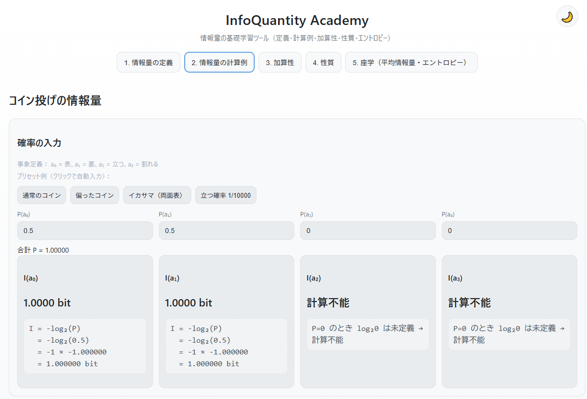

<!--
---
title: InfoQuantity Academy
category: information-theory
difficulty: 1
description: A beginner-friendly interactive web tool to grasp information quantity with definitions, worked examples, additivity, properties, and entropy.
tags: [information-theory, information-quantity, shannon, entropy, education, visualization, javascript]
demo: https://ipusiron.github.io/infoquantity-academy/
---
-->

# InfoQuantity Academy - 情報量の基礎学習ツール


[](https://ipusiron.github.io/infoquantity-academy/)

**Day073 - 生成AIで作るセキュリティツール100**

**InfoQuantity Academy**は、コンピューターサイエンスや数学に不慣れでも、**「情報量」(information quantity)** の直感と定義・性質を対話的に学べる入門ツールです。

- **「めったに起きない＝大きな情報量」**
- **確率から情報を定量化する、シャノンの情報理論をインタラクティブに体験**

---

## 🌐 デモページ

👉 **[https://ipusiron.github.io/infoquantity-academy/](https://ipusiron.github.io/infoquantity-academy/)**

ブラウザーで直接お試しいただけます。

---

## 📸 スクリーンショット

>
>*コイン投げの情報量の計算*

---

## 🎯 ねらい / できること

- 「まれさ＝驚き＝情報量」という直感を、例とグラフで体感
- シャノンの定義 $I(a) = -\log_2 P(a)$ を数式と図で理解
- コイン投げ（表/裏/立つ/割れる）の **確率を入力して即座に情報量を計算**
- **加算性**（独立事象の同時生起で情報量が和になる）を視覚的に理解
- 情報量が満たすべき **性質（単調性・連続性・加法性・規格化）** を整理
- 平均情報量＝**エントロピー** の導入まで（期待値・不確定さの両側面）
- **ダーク/ライトモード切り替え**でテーマを自由に選択可能

---

## 📖 使い方

### 推奨学習フロー（タブの順序が重要）

本ツールは**7つのタブを順番に進めることで段階的に理解が深まる**ように設計されています：

1. **デモを開く** → [GitHub Pages を開く](https://ipusiron.github.io/infoquantity-academy/)

2. **タブ1「基礎知識」から順番に学習**：
   - **タブ1（基礎知識）**：対数クイズで前提知識を確認し、段階的導入で理論的背景を理解
   - **タブ2（定義）**：基本概念とシャノンの定義を学習
   - **タブ3（体感）**：驚き度スライダーで直感と理論を比較体験
   - **タブ4（計算例）**：実際に確率値を入力して情報量を計算
   - **タブ5（加算性）**：独立事象での情報量の和を確認
   - **タブ6（性質）**：なぜこの定義が妥当なのかを4つの性質から理解
   - **タブ7（エントロピー・応用）**：平均情報量の概念と実世界応用を学習

3. **インタラクティブな要素を活用**：
   - 「計算例」タブのプリセットボタンで典型例を即座に試す
   - スライダーやグラフで視覚的に理解を深める
   - 計算過程も表示されるため、数式の意味を追いやすい

⚠️ **注意**：タブを飛ばすと前提知識が不足し、理解が困難になる場合があります。初学者は必ず順番通りに進めることをお勧めします。

---

## 👥 想定ユーザー
- 数学・CSに不慣れな一般/大学1年生  
- セキュリティに興味があり、**直感から数式**へ橋渡ししたい人  
- 「まずは手を動かして理解したい」タイプの学習者

---

## 📋 タブ構成

### 1. 基礎知識
- **対数クイズ**：情報量学習に必要な対数の基本知識を3問のクイズで確認
- **段階的導入**：なぜ対数が使われるのかを直感から数式まで段階的に解説
  - ステップ1：「珍しさ」と「情報の価値」の関係
  - ステップ2：独立事象の組み合わせと加算性の必要性
  - ステップ3：対数関数の性質と情報量定義への導出
- **事前準備**：後続タブで扱う概念の基礎固め

---

### 2. 情報量の定義
- **ボガートの名言**：「犬が人を噛んでもニュースにならないが、人が犬を噛んだらニュースになる」
  → めったに起きないほど **情報量が大きい**。
- **コイン投げの直感**：「表」より「立つ」の方がまれ → 情報量が大きい。
  ただし受け手の状況で価値は変わる（賭けの当事者は表/裏の方が重要）。
  ⇒ 「情報の価値＝f(内容, 受取手の状態)」。主観に依存する価値と区別し、**確率を用いて定量化**するのが情報理論。
- **シャノンの定義**
  $$I(a) = -\log_2 P(a)$$
  特徴：**$I \ge 0$**、**単調減少**、**$P=1$ で $I=0$**。
- **インタラクティブグラフ**：横軸 $P$、縦軸 $I=-\log_2 P$ および指数・一次・対数関数の比較グラフ

---

### 3. 体感
- **驚き度体感スライダー**：様々なシナリオで「理論的情報量」と「主観的驚き」を比較
- **豊富な実例**：宝くじ、コイン投げ、サイコロ、気象予報など日常的な確率事象
- **直感と理論の対比**：自分の感覚と数学的定義のズレを体感的に学習
- **スコアリング機能**：主観評価と理論値の一致度を数値で表示

---

### 4. 情報量の計算例（インタラクティブ）
**事象定義**：
- $a_0$ = 表、$a_1$ = 裏、$a_2$ = 立つ、$a_3$ = 割れる

**プリセット機能**：4つのシナリオボタンで一瞬で確率設定
- **通常のコイン**： (0.5, 0.5, 0, 0) → $I(\text{表})=I(\text{裏})=1 \text{ bit}$
- **偏ったコイン**： (0.6, 0.4, 0, 0) → 出やすい側の $I$ が小さくなる
- **イカサマ（両面表）**： (1, 0, 0, 0) → $I(\text{表})=0$（確実事象は情報量ゼロ）
- **立つ確率 1/10000**： (0.49995, 0.49995, 0.0001, 0)
  $$I(\text{表}) \approx I(\text{裏}) \approx 1.0001$$
  $$I(\text{立つ}) \approx 13.288$$

**機能**：
- 入力欄：$P(a_0), P(a_1), P(a_2), P(a_3)$（**合計=1** をリアルタイムチェック）
- 各事象の $I(a)=-\log_2 P(a)$ を **即座に計算**（計算過程も表示）
- **注意**：$P=0$ に対する $\log_2 0$ は **未定義**（計算不能として扱う）

---

### 5. 加算性（独立事象の和）
**定義の妥当性解説**：なぜ $I(a) = -\log_2 P(a)$ なのか（加算性を満たすため）

**2つのインタラクティブ計算器**：
1. **一般の独立事象 A, B**
   - 確率 P(A), P(B) を入力
   - $I(A), I(B), I(A\land B)$ を自動計算・表示
   - 加算性 $I(A\land B) = I(A) + I(B)$ を確認

2. **マンション例**
   - 階数・各階部屋数を入力（例：16階×8室 = 128室）
   - 階特定・号室特定・部屋番号特定の情報量を計算
   - **和の確認**：$I(\text{階}) + I(\text{号室}) = I(\text{部屋番号})$

---

### 6. 性質（情報量が満たすべき性質）
**4つの基本性質をカード形式で整理**：
- **単調減少性（Monotonicity）**：インタラクティブスライダーで P と I の関係を体感
- **連続性（Continuity）**：確率の微小な変化に対し、情報量も飛び跳ねない
- **加法性（Additivity）**：独立なら $I(A\land B)=I(A)+I(B)$
- **規格化（Normalization）**：基準（例：$P=1/2$ の情報量を $1$ bit）でスケールを固定

これらの条件が合わさると、（定数倍を除いて）**$-\log_2 P$** が自然な形に定まる。

---

### 7. エントロピー・応用（平均情報量と実世界への応用）
**エントロピーと攻撃の関係**：$n$ bit → $2^n$ 通りの可能性 → 平均 $2^{n-1}$ 回の試行で破綻

**エントロピー計算器**：最大4事象での $H(X) = -\sum_i P(x_i)\log_2 P(x_i)$ 計算

**応用分野**（詳細解説付き）：
- **データ圧縮**：シャノンの符号化定理、ハフマン符号やLZ圧縮への応用
  - 関連ツール：[Morse Tree Visualizer](https://ipusiron.github.io/morse-tree-visualizer/)
- **セキュリティ・暗号**：パスワード強度評価、エントロピーによる定量化
  - 関連ツール：[Token Entropy Estimator](https://ipusiron.github.io/token-entropy-estimator/)
- **暗号の基礎**：不確実性の制御・評価、条件付きエントロピーによる安全性測定
- **機械学習・AI**：決定木の情報利得、予測信頼度評価

---

### 加算性タブにおける情報量の定義と妥当性

加算性タブでは、冒頭で再び情報量の定義を提示しています。

$$I(a) = -\log_2 P(a)$$

これは単に形式的な定義を繰り返すだけではなく、**なぜこの形が妥当なのか**を確認する狙いがあります。

- **単調減少性**  
  確率 $P$ が小さいほど $I$ が大きくなる。直感「めったに起きない＝大きな情報量」に対応。

- **正の値**  
  $-\log_2 P$ によって常に $I \geq 0$ となり、情報量を非負値で測れる。

- **加算性**  
  独立事象 $A,B$ に対して  
  $$I(A \land B) = -\log_2 \{ P(A) \cdot P(B) \} = -\log_2 P(A) - \log_2 P(B) = I(A) + I(B)$$
  が成り立つ。  
  ⇒ 独立事象が同時に起きたときの情報量は、それぞれの情報量の和になる。

これらの性質を同時に満たす関数は（定数倍を除けば）$-\log P$ しかなく、**情報量の定義として妥当かつ自然**であることがわかります。

### 補足：なぜ「確率の逆数」ではなく「対数」を使うのか

直感的には「確率が小さいほど値が大きい」関数であれば情報量の尺度になりそうです。  
たとえば **逆数 $1/P$** でも「めったに起きない事象ほど値が大きい」性質は満たします。  
しかし逆数では、情報量として重要な **加算性** が成立しません。

- **逆数の場合**
  $$J(a) = \frac{1}{P(a)}$$
  独立事象 $A,B$ に対して
  $$J(A\land B) = \frac{1}{P(A)P(B)} = \frac{1}{P(A)} \cdot \frac{1}{P(B)} = J(A)\cdot J(B)$$  
  となり、積の関係しか得られません。情報量を「足し合わせる」ことができません。

- **対数の場合**
  $$I(a) = -\log P(a)$$
  ならば
  $$I(A\land B) = -\log \{P(A)P(B)\} = -\log P(A) - \log P(B) = I(A)+I(B)$$  
  が成り立ち、**情報量を加法的に扱える**ようになります。

したがって、「小さい確率に大きい値を与える」という直感を満たすだけでなく、  
**加算性を保証するためには「対数」を取る必要がある**のです。  
この理由から、情報量は $-\log P$ で定義するのが最も自然であり、唯一の選択になります。

---

## ⚠️ P=0 の扱いとエントロピーの約束

### P=0 のときの情報量
- 定義：$$I(a) = -\log_2 P(a)$$
- 結論：**$P(a)=0$ のとき $I(a)=+\infty$（理論上の無限大）**  
  └ 不可能事象が起きた＝その確率モデルが破綻している、という解釈。
- 本ツールの表示：**「∞ bit」**（ヘルプ注記：*$\log_2 0$ は未定義だが理論上は無限大*）
- 参考：$P=1$ のとき $I=0$（確実な事象は情報量ゼロ）

### エントロピーでの $0\log 0$
- エントロピー：$$H(X) = -\sum_i P(x_i)\log_2 P(x_i)$$
- 約束：**$0\log 0 = 0$** とみなす（極限 $\lim_{p\to 0^+} p\log p = 0$）。  
  └ よって、確率 0 の項は **H への寄与 0** として扱う。

---

## ⚙️ 実装上の仕様（本ツール）

- **計算例タブ**：  
  - 各事象の $I=-\log_2 P$ をリアルタイム計算。  
  - $P=0$ は **「∞ bit」** と表示（以前の「計算不能」表記を改めた）。  
  - 合計確率が 1 から外れた場合はエラー表示（計算は継続して可視化）。
- **加算性タブ**：  
  - 独立事象 $A,B$ の $I(A),I(B),I(A\land B)$ を表示。  
  - いずれかの確率が $0$ のときは該当の情報量を **「∞ bit」** と表示。
- **性質タブ（単調性スライダー）**：  
  - スライダーで $P\to 0$ に近づくと $I$ は急増し、**$P=0$ で「∞」**と表示。
- **エントロピー計算器**：  
  - 入力確率の合計をチェック。  
  - 各項の計算で **$0\log_2 0 \to 0$** と明示して計算を進める。

> 数学的注意：対数の真数は正（$P>0$）である必要があり、**0 は真数として許されない**。  
> 本ツールは学習目的で「表示上は ∞」として取り扱い、**理論上の挙動**を分かりやすく示す。

---

## 💡 具体的な活用シナリオ

### シナリオ1：侵入検知システムの異常度評価
**場面**：ネットワーク監視で「めったに起きないアクセスパターン」を検出したい

1. **正常時の学習**：通常のアクセスパターンの確率分布を記録
   - 例：日中のアクセス $P=0.8$、深夜のアクセス $P=0.2$
2. **情報量による異常度スコアリング**：
   - 深夜3時の大量アクセス（$P=0.001$）→ $I = -\log_2(0.001) \approx 9.97$ bit
   - 通常の日中アクセス（$P=0.8$）→ $I = -\log_2(0.8) \approx 0.32$ bit
3. **アラート判定**：情報量が閾値（例：$5$ bit）を超えたら管理者に通知
   - **効果**：「まれさ」を定量化し、誤検知を減らしつつ真の異常を見逃さない

### シナリオ2：ログ圧縮の最適化
**場面**：大量のWebサーバーログを効率的に圧縮・保存したい

1. **ログメッセージの出現確率を分析**：
   - "200 OK" ($P=0.7$) → $I \approx 0.51$ bit
   - "404 Not Found" ($P=0.1$) → $I \approx 3.32$ bit
   - "500 Internal Error" ($P=0.001$) → $I \approx 9.97$ bit
2. **ハフマン符号化の適用**：
   - 頻出パターン（低情報量）→ 短い符号を割り当て
   - まれなパターン（高情報量）→ 長い符号を割り当て
3. **圧縮率の理論的限界**：
   - エントロピー $H(X)$ を計算 → 平均符号長の下限値が判明
   - **効果**：ストレージコストを最小化しながら、重要な異常ログも確実に保存

これらのシナリオで共通するのは、**「確率→情報量→実用的な意思決定」** という流れです。InfoQuantity Academyで学んだ基礎理論が、実際のシステム設計や運用で威力を発揮します。

---

## 🔗 関連ツール

### Token Entropy Estimator
本ツールで学んだ「エントロピー（情報量の期待値）」の概念は、セキュリティ分野で実用的に活用されています。

🔗 **[Token Entropy Estimator](https://ipusiron.github.io/token-entropy-estimator/)**
パスワードやAPIキー・トークンの強度を「エントロピー（bit）」で定量評価するツール。

**InfoQuantity Academy との関連性：**
- **理論的基礎**：本ツールで学ぶ情報量 $I=-\log_2 P$ とエントロピー $H(X)$ の概念が、トークン強度評価の数学的基盤
- **エントロピーの応用**：文字種・長さから計算される「ランダムさ」をbit単位で測定
- **実践的活用**：均等分布（各文字が等確率で選ばれる）のときエントロピーが最大 → セキュリティが最強

学習の流れ：
1. **InfoQuantity Academy**：情報量・エントロピーの基礎理論を習得
2. **Token Entropy Estimator**：セキュリティ分野での実践的応用を体験

### Morse Tree Visualizer
歴史的な効率的符号化の実例として、モールス信号の構造を可視化するツール。

🔗 **[Morse Tree Visualizer](https://ipusiron.github.io/morse-tree-visualizer/)**
モールス信号の二分木構造と符号体系を対話的に学習。

**InfoQuantity Academy との関連性：**
- **効率的符号化の実例**：頻出文字ほど短い符号を割り当てる設計思想
  - E (最頻出) → 「・」（1信号）
  - T (2番目) → 「ー」（1信号）
  - Q (低頻度) → 「ーー・ー」（4信号）
- **エントロピーと符号長**：使用頻度を考慮した平均符号長の最小化
- **歴史的意義**：情報理論が確立する前から、経験的に効率的符号化を実現していた例

モールス信号は、シャノンの情報理論（1948年）よりも約100年前（1840年代）に発明されましたが、図らずも「頻出パターンを短く符号化」という情報理論の原則を体現していました。

---

## 🔐 暗号における不確実性の制御・評価

「暗号の基礎：不確実性の制御・評価」とは、情報理論が暗号技術の安全性評価と設計の根幹を成すという意味です。

### 古典暗号から見た不確実性

#### シーザー暗号（紀元前1世紀）
- **仕組み**：アルファベットを3文字ずらす（A→D、B→E...）
- **エントロピー**：鍵空間はわずか$26$通り → $\log_2(26) \approx 4.7$ bit
- **弱点**：不確実性が低すぎて総当たり攻撃に脆弱
- **情報理論的評価**：$H(\text{平文}|\text{暗号文}) \approx 0$（暗号文から平文がほぼ確定）

#### エニグマ暗号機（第二次世界大戦）
- **仕組み**：複数のローターによる多段階換字
- **エントロピー向上の工夫**：
  - 日替わり設定：$10^{23}$ 通りの組み合わせ → 約$76$ bit
  - 各文字ごとにローター回転で換字表が変化
- **限界**：統計的偏り（同じ文字が自分自身に暗号化されない等）により情報が漏洩
- **教訓**：エントロピーを増やしても、規則性が残ると脆弱

### 現代暗号から見た不確実性

#### AES（Advanced Encryption Standard）
- **鍵のエントロピー**：
  - AES-128：$128$ bit（$2^{128} \approx 3.4\times10^{38}$ 通り）
  - AES-256：$256$ bit（$2^{256} \approx 1.2\times10^{77}$ 通り）
- **設計思想**：
  - **混乱（Confusion）**：鍵と暗号文の関係を複雑化 → 条件付きエントロピーを最大化
  - **拡散（Diffusion）**：$1$ bit変更が全体に波及 → 局所的な情報漏洩を防止
- **安全性の定量評価**：
  - 既知平文攻撃下でも $H(\text{鍵}|\text{平文},\text{暗号文}) \approx H(\text{鍵})$ を維持

#### RSA暗号（公開鍵暗号）
- **不確実性の源泉**：大きな素数の素因数分解困難性
- **鍵長とエントロピー**：
  - $2048$ bit鍵：約$112$ bitの安全性（対称鍵換算）
  - $4096$ bit鍵：約$140$ bitの安全性
- **情報理論的特徴**：
  - 公開鍵が与えられた時の秘密鍵の条件付きエントロピー $H(\text{秘密鍵}|\text{公開鍵}) \approx H(\text{秘密鍵})$（計算困難性による）
  - つまり公開鍵から秘密鍵への相互情報量 $I(\text{秘密鍵};\text{公開鍵}) \approx 0$
  - ただし無限の計算力があれば I > 0（情報理論的安全ではない）

### 量子暗号と完全な不確実性

#### 量子鍵配送（QKD）
- **原理**：量子力学の不確定性原理を利用
- **盗聴検知**：観測により量子状態が変化 → エントロピー変化で検出可能
- **情報理論的安全性**：盗聴者の得る情報量を厳密にゼロに制御

### エントロピーから見た攻撃の実現可能性

上表の「鍵のエントロピー」は、単なる数値ではなく**攻撃の困難さを定量化**したものです。

**シーザー暗号の例**：
- $H(\text{鍵}) = \log_2(26) \approx 4.7$ bit
- 意味：$2^{4.7} \approx 26$ 通りの鍵 → 最大26回、平均13回の試行で破綻
- 現代のコンピューターなら**マイクロ秒単位**で完了
- 手作業でも**数分**で全数調査可能

**AES-128との比較**：
- $H(\text{鍵}) = 128$ bit
- 意味：$2^{128}$ 通りの鍵 → 平均 $2^{127}$ 回の試行が必要
- 現在の技術では**宇宙の年齢より長時間**

**重要な関係式**：
$$
\begin{align}
\text{エントロピー } n \text{ bit} &\to 2^n \text{ 通りの鍵空間} \\
&\to \text{平均 } 2^{n-1} \text{ 回の試行} \\
&\to \text{攻撃時間} = 2^{n-1} \times \text{(1回あたりの計算時間)}
\end{align}
$$

これにより、情報理論は「弱い」「強い」という主観的評価を**数学的に定量化**し、セキュリティレベルを客観的に比較可能にします。

暗号の歴史は「いかに不確実性を増やし、制御するか」の歴史であり、情報理論はその定量的な評価基準を提供しています。

### まとめ：進化する不確実性の制御

| 暗号方式 | 鍵のエントロピー $H(\text{鍵})$ | 総当たり攻撃の試行回数 | 現実的な攻撃時間 | 結果 |
|---------|------------------|------------------|--------------|------|
| シーザー暗号 | $\log_2(26) \approx 4.7$ bit | 最大26回、平均13回 | マイクロ秒〜数分 | 容易に破綻 |
| エニグマ | $\log_2(10^{23}) \approx 76$ bit | 平均 $\sim 2^{75}$ 回 | 統計解析により短縮 | 実際には破綻 |
| AES-128 | $\log_2(2^{128}) = 128$ bit | 平均 $\sim 2^{127}$ 回 | 宇宙年齢の $10^{20}$ 倍 | 実用的に安全 |
| RSA-2048 | 鍵長 $2048$ bit | 素因数分解アルゴリズム | 現在は数十年レベル | まだ安全 |
| ワンタイムパッド | $H(\text{鍵}) = H(\text{平文})$ | 無限大（情報得られず） | 破綻不可能 | 理論的に完全 |
| 量子暗号 | 物理法則で保証 | 盗聴検知で阻止 | 物理的に不可能 | 理論的に完全 |

---

## 📁 ディレクトリー構成

```
infoquantity-academy/
├── index.html          # メインHTMLファイル（7つのタブインターフェース）
├── script.js           # JavaScript ロジック（情報量計算・グラフ描画・テーマ切り替え）
├── style.css          # CSS スタイル（ダーク/ライトモード対応）
├── README.md          # プロジェクト説明書（本ファイル）
├── CLAUDE.md          # 開発者向けガイド
├── LICENSE            # MIT ライセンス
├── .gitignore         # Git 除外設定
├── .nojekyll          # GitHub Pages 設定
└── .claude/           # Claude Code 設定
    └── settings.local.json
```

---

## 📄 ライセンス

MIT License – 詳細は [LICENSE](LICENSE) を参照してください。

---

## 🛠 このツールについて

本ツールは、「生成AIで作るセキュリティツール100」プロジェクトの一環として開発されました。
このプロジェクトでは、AIの支援を活用しながら、セキュリティに関連するさまざまなツールを100日間にわたり制作・公開していく取り組みを行っています。

プロジェクトの詳細や他のツールについては、以下のページをご覧ください。

🔗 [https://akademeia.info/?page_id=42163](https://akademeia.info/?page_id=42163)
