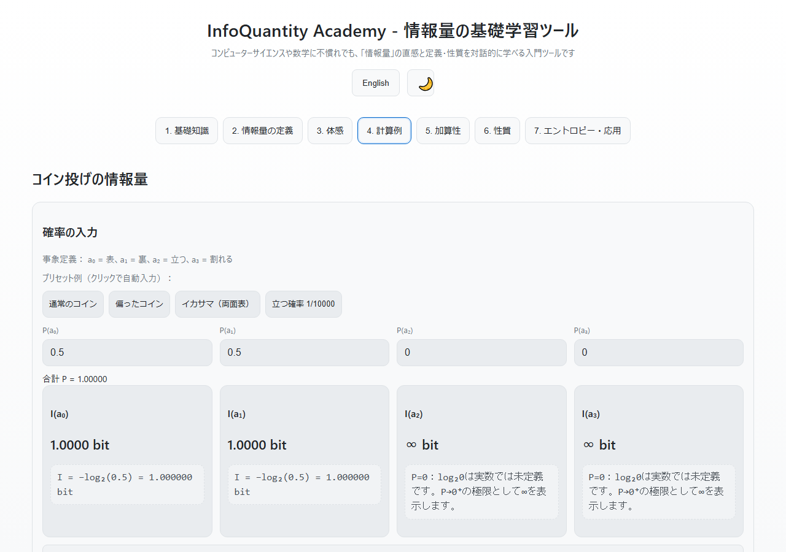
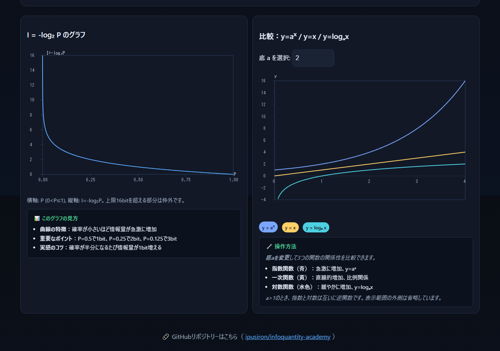
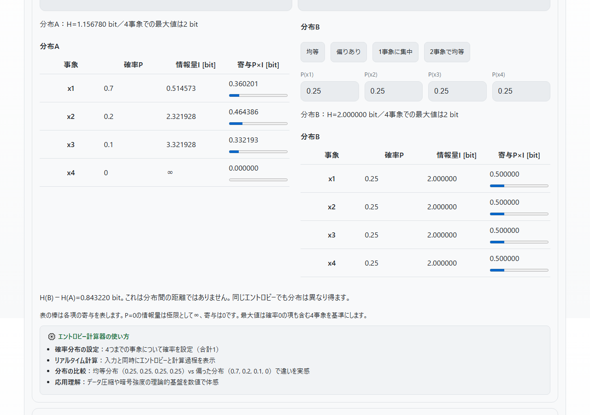
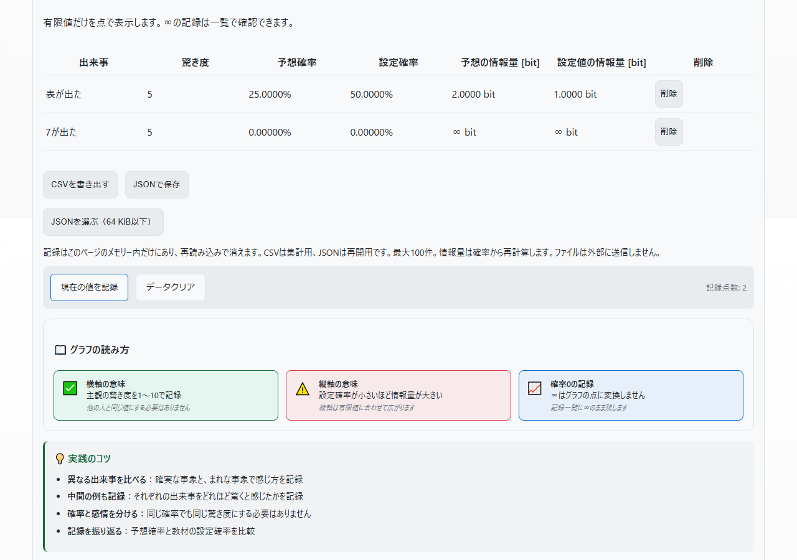

<!--
---
id: day073
slug: infoquantity-academy

title: "InfoQuantity Academy"

subtitle_ja: "情報量の基礎学習ツール"
subtitle_en: "Interactive Information Theory Learning Tool"

description_ja: "コンピューターサイエンスや数学に不慣れでも、情報量 I(a)=-log₂P(a) の直感と定義・性質を対話的に学べる入門ツール。対数クイズ、驚き度体感スライダー、計算例、加算性、エントロピーまで段階的に学習。"
description_en: "A beginner-friendly interactive web tool to grasp information quantity with definitions, worked examples, additivity, properties, and entropy. Learn Shannon's information theory through quizzes, intuition sliders, and interactive calculators."

category_ja:
  - 情報理論
category_en:
  - Information Theory

difficulty: 3

tags:
  - information-theory
  - information-quantity
  - shannon
  - entropy
  - education
  - visualization
  - javascript

repo_url: "https://github.com/ipusiron/infoquantity-academy"
demo_url: "https://ipusiron.github.io/infoquantity-academy/"

hub: true
---
-->

[English](README.en.md) · 日本語

# InfoQuantity Academy - 情報量の基礎学習ツール


[](https://ipusiron.github.io/infoquantity-academy/)

**Day073 - 生成AIで作るセキュリティツール100**

InfoQuantity Academyは、確率から情報量を計算し、対数・加算性・エントロピーを7つのタブで学ぶ入門ツールです。情報量は、設定した確率モデルでの「まれさ」の尺度であり、内容の重要性や人が感じる驚きとは区別します。

## 🌐 デモページ

[日本語で開く](https://ipusiron.github.io/infoquantity-academy/?lang=ja) · [Open in English](https://ipusiron.github.io/infoquantity-academy/?lang=en)

ブラウザーで利用できます。ダウンロードしたフォルダーのindex.htmlを直接開くこともできます。

## 📸 スクリーンショット



表と裏がそれぞれ0.5のモデルでは、どちらも1 bitです。


予想確率25%と設定確率50%の情報量を比較します。主観の驚き度は採点しません。



確率と情報量の関係を確認できます。画像は1280×900pxです。



> *各項の寄与と、分布A・Bのエントロピーの差を確認できます。*



> *確率0の記録も∞として残し、個別削除とCSV／JSONでの保存ができます。*

## 🎯 ねらい・できること

- 対数クイズとグラフで、I(a) = −log₂P(a)の定義を学習
- 予想確率と設定確率、およびそれぞれの情報量を比較
- 主観の驚き度を1～10で記録（最大100点、採点なし）
- 独立事象の加算性、単調性、連続性、規格化を確認
- 最大4事象の分布から平均情報量H(X)を計算
- 4種類の例で各項の寄与を確認し、2つの分布のエントロピーを比較
- 記録の個別削除、CSV出力、JSON保存と確認後の読み込み
- 一様ランダムな文字列の候補数と平均推測回数を計算
- 日本語・英語、ライト・ダークテーマを切り替え

## 📖 使い方

まず「計算例」で「通常のコイン」を押してください。P(a₀)=P(a₁)=0.5で、それぞれの情報量が1 bitになることを確認できます。残りの事象は確率0なので情報量は∞と表示しますが、その事象が実際に起きるという意味ではありません。

### 推奨学習フロー

1. 「基礎知識」で3問の対数クイズに回答する。
2. 「情報量の定義」で確率と情報量の関係を確認する。
3. 「体感」で出来事を選び、驚き度と予想確率を入力して設定値と比較する。
4. 「計算例」「加算性」「性質」で値を変え、計算過程を確認する。
5. 「エントロピー・応用」で分布の偏りと平均情報量を比較する。

### 言語・テーマ・記録

言語の初期値はURLのlang=ja/en、保存設定、ブラウザーの言語の順に決まります。テーマは保存設定、OS設定の順です。保存できない環境でも利用できます。

言語を切り替えても入力・記録・クイズの回答は保持します。テーマと言語だけをlocalStorageに保存し、入力値や学習記録は保存しません。再読み込みすると記録は消えます。「データクリア」は体感タブの記録、「リセット」はクイズの回答を消します。

タブはTabキーで移動し、フォーカスがあるときに左右矢印・Home・Endでも切り替えられます。

### 分布の内訳と比較

「エントロピー・応用」の計算器で、分布A・Bの確率をそれぞれ4つ入力します。「均等」「偏りあり」「1事象に集中」「2事象で均等」から例を入れることもできます。表には確率P、情報量I、エントロピーへの寄与P×Iを表示し、棒の長さは寄与を表します。

最大値は確率0の項も含む4事象を基準にしたlog₂4=2 bitです。確率0の情報量は∞、寄与は0として表示します。H(B)−H(A)は平均情報量の差であって、分布間の距離ではありません。同じエントロピーでも分布は異なり得ます。無効な入力がある場合は、内訳と比較結果を表示しません。

### 記録の保存と再開

「体感」の記録表には、出来事、主観の驚き度、予想確率、設定確率、それぞれの情報量を表示します。1行ずつ削除でき、狭い画面では表の枠内を横にスクロールできます。表の枠はキーボードでもフォーカスできます。

1. 集計用には「CSVを書き出す」、再開用には「JSONで保存」を選ぶ。
2. 再開するときは「JSONを選ぶ」で本ツールが保存したファイルを選ぶ。
3. 件数と置き換えの注意を確認する。現在の記録が必要なら、先にJSONで保存する。
4. 「確認した記録に置き換える」を押す。選んだだけでは記録は変わらず、取り消しも可能。

読み込みは追記ではなく全件の置き換えです。確認待ちや読み込み中に記録を追加・削除・クリアすると、読み込みは取り消されます。言語切り替えでは確認待ちの状態も保持します。ファイルはブラウザー内で処理し、外部には送信しません。

### 保存ファイルの仕様

CSVの保存名は`infoquantity-records.csv`で、列は`event_id,surprise,predicted_probability,model_probability,predicted_information_bits,model_information_bits`です。確率は0～1、単位はbit、無限大は`Infinity`と書き出します。予想確率と設定確率は別の列です。出来事は固定IDを使い、CSVの読み込みは行いません。

JSONの保存名は`infoquantity-records.json`です。UTF-8、最大64 KiB（65536バイト）、最大100件で、形式名・版・フィールド・値を検証します。知らないフィールドや出来事ID、文字列にした数値、教材の設定と一致しない確率は受け付けません。驚き度は1～10の整数です。情報量は保存せず、読み込み時に確率から再計算します。不正なファイルでは現在の記録を変更しません。空の記録も読み込めますが、置き換えを確定すると現在の記録は0件になります。

```json
{
  "format": "infoquantity-academy-records",
  "version": 1,
  "records": [
    { "event": "seven", "surprise": 5, "predicted": 0, "probability": 0 }
  ]
}
```

この例の`seven`は公正な6面サイコロで「7が出た」という教材用の出来事です。予想・設定の情報量はともに∞になります。JSONが読み込めることは、記録の真正性や改ざんされていないことの証明にはなりません。

## 👥 想定ユーザー

- 確率・対数・情報理論を学ぶ学生
- 授業で例題を示す教員
- 圧縮・異常度・予測モデルの前提を確認したい開発者
- 鍵の不確実性と暗号の安全強度を区別したい学習者

## 📋 タブ構成

| タブ | 内容 |
|---|---|
| 1. 基礎知識 | 対数の3問クイズと段階的な説明 |
| 2. 情報量の定義 | I(a)=−log₂P(a)、対数・指数・直線の比較 |
| 3. 体感 | 予想と設定の比較、主観の驚き度と情報量の記録 |
| 4. 計算例 | コインの4事象、プリセット、計算過程 |
| 5. 加算性 | 独立事象と等確率の部屋の特定 |
| 6. 性質 | 単調性・連続性・加法性・規格化 |
| 7. エントロピー・応用 | 平均情報量、圧縮、暗号、物理、機械学習 |

体感タブの出来事は個別の教材用設定です。同じシナリオ内でも、排反で全体を尽くす事象の一覧ではありません。天気やくじの確率は実測値・予報・実在する商品の当選確率ではありません。公正なサイコロで「6回とも1」は1/46656です。

## 🧮 情報量とエントロピー

### 定義と加算性

情報量はI(a)=−log₂P(a)です。独立なA、BではP(A∧B)=P(A)P(B)なので、I(A∧B)=I(A)+I(B)となります。独立でなければ、条件付き確率が必要です。

正の確率での加算性と単調性を仮定すると、対数の形が定まります。P=1/2の情報量を1と規格化すると単位はbitです。自然対数ではnat、底10ではditになります。

1/Pだけでは確率の積が情報量の和になりません。対数を取ることで、独立な情報を足し算で扱えます。

### 確率0と連続性

log₂0は実数では未定義です。本ツールはP→0⁺の極限を∞と表示します。離散モデルで確率0の事象が観測された場合は、モデルの前提を見直す必要があります。

エントロピーH(X)=−ΣP(x)log₂P(x)では、確率0の項の寄与を極限により0とします。∞どうしの差は計算せず、記録の∞も有限値へ置き換えません。グラフには有限値だけを描きます。

−log₂Pは0<P≤1で連続ですが、同じ確率差でも0に近いほど情報量の差が大きくなります。2点だけを比べて連続かどうかを判定するものではありません。

### 計算の確認値

| 条件 | 結果 |
|---|---|
| P=1 | 0 bit |
| P=0.5 | 1 bit |
| P=0.125 | 3 bit |
| P=0.0001 | 約13.287712 bit |
| P=0 | ∞ bit（極限の表示） |
| 分布(0.25, 0.25, 0.25, 0.25) | H=2 bit |
| 分布(1, 0, 0, 0) | H=0 bit |
| 16階×各階8室、全室等確率 | 4+3=7 bit |
| 等確率の26候補、重複なしの推測 | 平均13.5回 |

比較用の例は、画面と同じく小数点以下6桁で示します。

| 例ID | 確率分布 | H [bit] |
|---|---|---|
| uniform | (0.25, 0.25, 0.25, 0.25) | 2.000000 |
| biased | (0.7, 0.2, 0.1, 0) | 1.156780 |
| certain | (1, 0, 0, 0) | 0.000000 |
| binary | (0.5, 0.5, 0, 0) | 1.000000 |

Aをbiased、Bをuniformにすると、H(B)−H(A)=0.843220 bitです。差は丸め前の値から計算します。

## ⚙️ 入力と表示の仕様

| 入力 | 範囲・条件 |
|---|---|
| 確率 | 0～1。空欄・負数・範囲外・非数値はエラー |
| 分布 | 合計1、許容誤差0.000001 |
| 予想確率 | 0～100% |
| 階数・各階の部屋数 | 1～1000の整数 |
| 文字数・文字種類数 | 1～100、1～95の整数 |
| 比較グラフの底a | 1より大きく100以下 |
| 単調性スライダー | 0.0001～1 |
| 体感の記録 | 最大100点 |

不正な入力を丸めたり、自動で範囲内に戻したり、分布を正規化したりしません。無効な計算結果は「—」とエラー文で示します。表示値は丸められるため、画面上の足し算に丸め差が出る場合があります。

独立確率の積が浮動小数点で表現できないほど小さくなっても、情報量は対数の和で計算します。指数関数などの比較グラフは表示範囲内を描く教材であり、任意精度の計算器ではありません。

## 💡 具体的な活用シナリオ

このツールならではの使い方

- めったに起きないことほど情報量が大きいことを確かめる（情報量の定義の授業）：確率0.5のコインの表は1 bit、確率1/6のサイコロの1は約2.58 bit、確率0.001のまれな出来事は約9.97 bitになる。確率が小さいほど「起きたと知ったときの驚き」が大きく、情報量が増える。情報量が確率の対数（−log₂p）で決まることを、数で確かめられる
- 独立な出来事の情報量が足し算になることを確かめる（対数の性質の授業）：確率0.5のコインの表（1 bit）と確率1/6のサイコロの1（約2.58 bit）が同時に起きると、情報量は約3.58 bitで、2つの情報量の和になる。同時に起きる確率は0.5×1/6＝1/12で掛け算だが、対数を取ると情報量は足し算になる。かけ算を足し算に変える対数のはたらきを確かめられる
- 均等な分布でエントロピーが最大になることを確かめる（エントロピーの授業）：4つの目が等確率（各0.25）のときエントロピーは2 bitで、これは4通りの最大値（log₂4）である。偏った分布0.9と0.1では約0.47 bitまで下がる。結果が読みにくい（均等な）ときに平均情報量が最大になり、偏るほど下がることを、分布を変えて確かめられる

### 授業での確率比較

公正なコインの表は1 bit、公正なサイコロの1は約2.58 bitです。確率を先に予想してから設定値と比べることで、確率と感情の違いを話し合えます。

### 異常度の考え方

仮のモデルでP=0.001なら約9.97 bitです。ただし、まれな出来事が攻撃とは限らず、モデルやしきい値だけで誤検知や見逃しが解消するわけではありません。本ツールはログの収集・学習・侵入検知を行いません。

### ログや文章の圧縮

出現確率から平均情報量を求め、平均符号長との関係を学べます。離散情報源の一意復号可能な符号では、平均符号長はエントロピー以上です。画面の文字頻度表は1000文字の教材例の一部であり、完全な分布やHuffman符号表ではありません。⌈情報量⌉も実際の符号割り当てではありません。

### 予測モデルの理解

言語モデルは正解トークンの予測確率に基づくクロスエントロピー損失を利用します。決定木の情報利得では、分割後の各群のエントロピーを群の大きさで重み付けします。本ツールはモデルの学習や評価を実行しません。

## 🔐 暗号での前提と限界

### 鍵の不確実性と推測回数

N個の候補が等確率で、重複なく順に試し、正解を判別できる場合、H=log₂N、平均推測回数=(N+1)/2です。正解を試す1回も含みます。一般の偏った分布の平均推測回数は、Shannonエントロピーだけでは決まりません。

文字種類数S、長さLのモデルでは、各文字を独立に等確率で選ぶと仮定し、N=S^L、H=L log₂Sと計算します。95文字は空白を含む印字可能ASCII文字です。人が選んだ単語や再利用は評価せず、実際のパスワードも入力しません。

### 古典暗号と現代暗号

26シフトを一様に選ぶシーザー暗号の鍵エントロピーはlog₂26≈4.700440 bitです。正解を判別できる全候補探索の平均は13.5回ですが、鍵を固定した場合や言語の偏りを利用する場合とは前提が異なります。エニグマの候補数も、機種・設定・攻撃者が知っている情報に依存します。

AESの鍵エントロピーと、既知平文などを使った攻撃の計算量は同じではありません。RSAの2048 bitという鍵長を、そのまま2048 bitの安全強度や鍵エントロピーと解釈できません。

| 方式 | 鍵長 | 古典計算での安全強度の目安 |
|---|---|---|
| AES-128 | 128 bit | 128 bit |
| AES-256 | 256 bit | 256 bit |
| RSA-2048 | 2048 bit | 112 bit |

[NIST SP 800-57 Part 1 Rev.5、Table 2](https://nvlpubs.nist.gov/nistpubs/SpecialPublications/NIST.SP.800-57pt1r5.pdf)の比較値です。実装、鍵管理、利用モード、攻撃手法を含む安全性の保証ではなく、量子計算への耐性を示すものでもありません。攻撃時間には試行速度などの条件が必要です。

### 完全秘匿性と量子鍵配送

完全秘匿性はH(平文|暗号文)=H(平文)、すなわち暗号文の観測で平文の不確実性が減らない性質です。ワンタイムパッドでは、平文と独立な一様乱数の鍵を平文と同じ長さだけ用意し、再利用しません。改ざん検知や安全な鍵配送は別途必要です。

量子鍵配送も装置・実装・認証などの前提を必要とし、通信全体が無条件に安全になるという意味ではありません。本ツールは暗号方式の安全性を認定しません。

## 🔗 関連ツール・参考資料

### Token Entropy Estimator

[Day048のツール](https://ipusiron.github.io/token-entropy-estimator/)では、文字種・長さ・形式から、仮定に基づくランダム部分や推測時間を検討できます。文字列だけから生成過程のランダムさを確定できるわけではありません。

### MorseTree Visualizer

[Day025のツール](https://ipusiron.github.io/morse-tree-visualizer/)では、モールス符号の木・チャート・変換を学べます。点と線の所要時間や文字間隔が異なるため、符号の要素数をそのままbit数とみなしたり、Huffman符号と同一視したりしません。

### 理論の参考資料

- [Gray, Entropy and Information Theory](https://ee.stanford.edu/~gray/it.pdf)：情報量・エントロピー・条件付きエントロピー
- [Bennett, Notes on Landauer's principle](https://www.cs.princeton.edu/courses/archive/fall04/cos576/papers/bennett03.pdf)：測定と記憶の消去の区別

情報エントロピーが時間とともに必ず増える法則はありません。標準的な熱浴モデルで、0と1が等確率の未知の1 bitを論理的に不可逆に消去するときの散逸の下限はkBT ln2です。測定そのものに同じ下限を一律に適用しません。

## 🧪 テスト・セキュリティ

Node.js 22以上で、依存パッケージをインストールせずに実行できます。

```sh
npm test
```

計算の既知値、境界値、入力検証、日英辞書、文書の対応、UIの安全性を検査します。GitHub Actionsでもpushとpull_request時にNode.js 22で実行します。

分布比較の既知値、JSONの往復・容量と件数の上限・不正値の拒否、CSVの列と∞、読み込みの確定経路も検査します。CSVは許可された固定IDと検証済み数値から生成し、読み込んだ文字列をHTMLとして挿入しません。

アプリは入力を外部へ送信せず、外部スクリプトやCDNを読み込みません。CSPでインラインスクリプト・動的評価・通信を制限し、動的な表示にはtextContentを使います。外部リンクを開いた場合はリンク先へアクセスします。

## 📁 ディレクトリー構造

```text
infoquantity-academy/        # プロジェクトルート
├── .github/                 # GitHub設定
│   └── workflows/           # 自動テストの定義
│       └── test.yml         # Node.js 22のテスト
├── assets/                  # 日本語画面の画像
│   ├── en/                  # 英語画面の画像
│   │   ├── screenshot.png   # 英語・計算例
│   │   ├── screenshot2.png  # 英語・体感
│   │   ├── screenshot3.png  # 英語・ダークテーマ
│   │   ├── screenshot4.png  # 英語・分布比較
│   │   └── screenshot5.png  # 英語・記録の保存
│   ├── screenshot.png       # 日本語・計算例
│   ├── screenshot2.png      # 日本語・体感
│   ├── screenshot3.png      # 日本語・ダークテーマ
│   ├── screenshot4.png      # 日本語・分布比較
│   └── screenshot5.png      # 日本語・記録の保存
├── test/                    # Node.js組み込みテスト
│   ├── core.test.js         # 計算と境界値
│   ├── learning.test.js     # 分布比較と記録形式
│   ├── learning-ui.test.js  # 安全な入出力と表示契約
│   ├── readme.test.js       # 日英文書と静的翻訳
│   └── ui-contract.test.js  # UI・辞書・CSP
├── .gitignore               # Git除外設定
├── .nojekyll                # Jekyll処理の無効化
├── CLAUDE.md                # 開発時の規則
├── LICENSE                  # MITライセンス
├── README.md                # 日本語の説明
├── README.en.md             # 英語の説明
├── core.js                  # DOMに依存しない計算
├── i18n.js                  # 静的翻訳と言語切り替え
├── index.html               # 7タブの画面と教材
├── learning-core.js         # 分布比較・記録形式・教材モデル
├── learning-ui.js           # 分布の入力と内訳表示
├── lesson-en.js             # 教材の英訳
├── messages.js              # 動的表示の日英辞書
├── package.json             # 依存なしのテスト設定
├── records-ui.js            # CSV／JSONと確認後の読み込み
├── script.js                # UI更新とグラフ
├── settings.js              # 初期言語・テーマ
└── style.css                # レスポンシブ表示
```

## 💻 動作環境

JavaScript、Canvas、BigIntに対応するモダンブラウザーを使用してください。ビルドは不要で、HTTP(S)とfile://で動作します。モバイル幅では1列、広い画面では複数列になります。ブラウザーが動きを減らす設定の場合はアニメーションを抑制します。

## 📄 ライセンス

MIT License。詳細は[LICENSE](LICENSE)を参照してください。

## 🛠️ このツールについて

本ツールは、「生成AIで作るセキュリティツール100」プロジェクトの一環として開発されました。
このプロジェクトでは、AIの支援を活用しながら、セキュリティに関連するさまざまなツールを100日間にわたり制作・公開していく取り組みを行っています。

[プロジェクトの詳細とほかのツール](https://akademeia.info/?page_id=42163)
